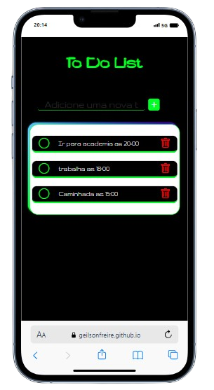
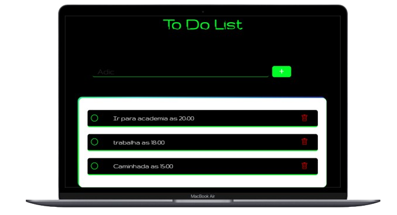

# To_do_List  
## Deloy: https://geilsonfreire.github.io/To_do_List/

    
    

# Lista de Tarefa

O projeto consiste na criação de uma lista de tarefas utilizando HTML, CSS, JavaScript e a biblioteca Bootstrap Icon. A lista de tarefas é uma aplicação simples que permite aos usuários adicionar, marcar como concluídas e excluir tarefas. A inclusão da responsividade garante que a aplicação seja adaptável a diferentes dispositivos e tamanhos de tela, proporcionando uma experiência consistente e amigável para o usuário em computadores, tablets e smartphones.

A implementação da responsividade é realizada principalmente através de técnicas de CSS, como o uso de media queries para ajustar o layout e os estilos conforme o tamanho da tela. Elementos como a barra de navegação, botões e campos de entrada são dimensionados e reorganizados para garantir que sejam facilmente acessíveis e utilizáveis em dispositivos móveis, mantendo a funcionalidade e a estética da lista de tarefas.

Além disso, a utilização da biblioteca Bootstrap Icon adiciona ícones às diferentes ações da lista de tarefas, tornando a interface mais intuitiva e fácil de entender para o usuário. Esses ícones são adaptáveis e se ajustam automaticamente ao tamanho da tela, contribuindo para uma experiência de usuário coesa e agradável em dispositivos de todos os tamanhos.

Em resumo, o projeto de lista de tarefas com responsividade proporciona uma maneira eficiente e conveniente para os usuários gerenciarem suas tarefas em qualquer dispositivo, garantindo uma experiência consistente e amigável independentemente do tamanho da tela.